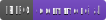
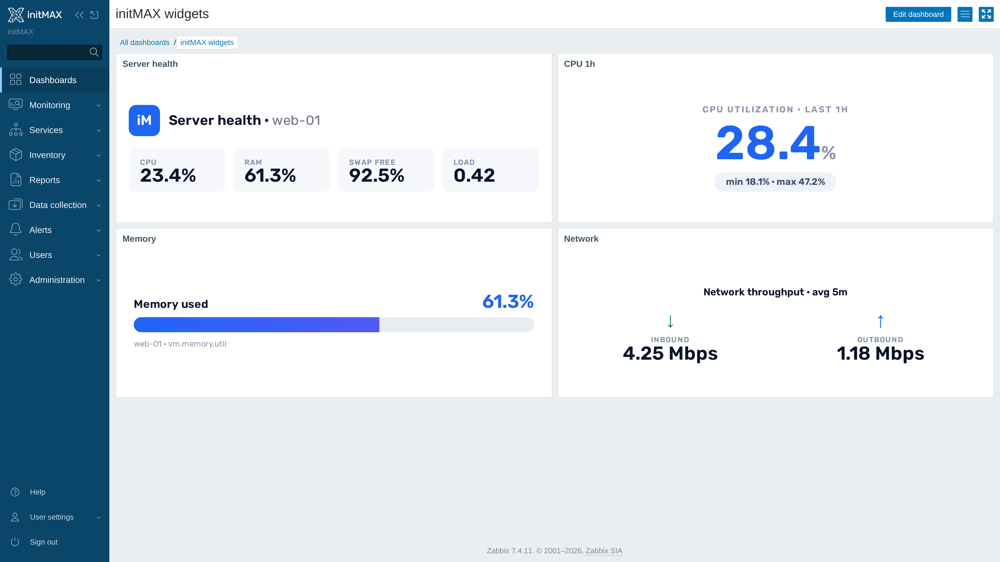
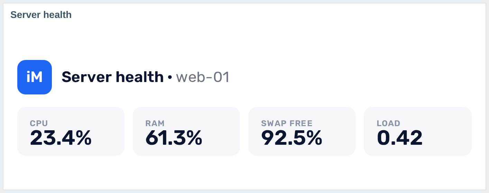
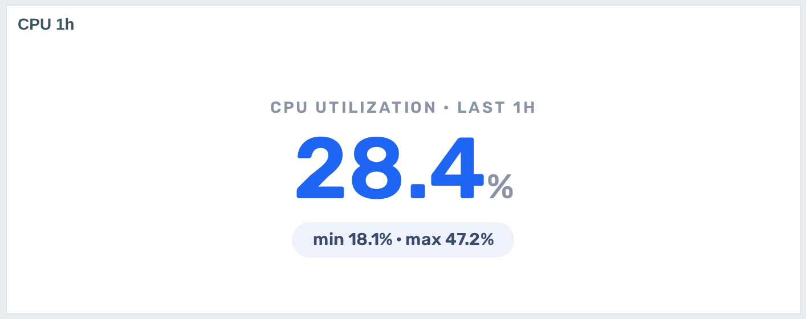
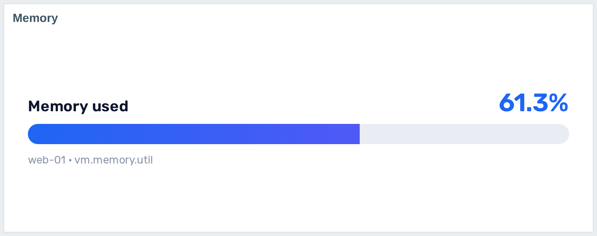
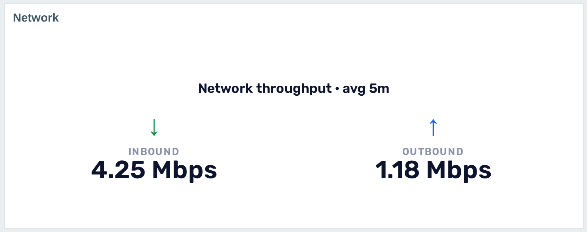
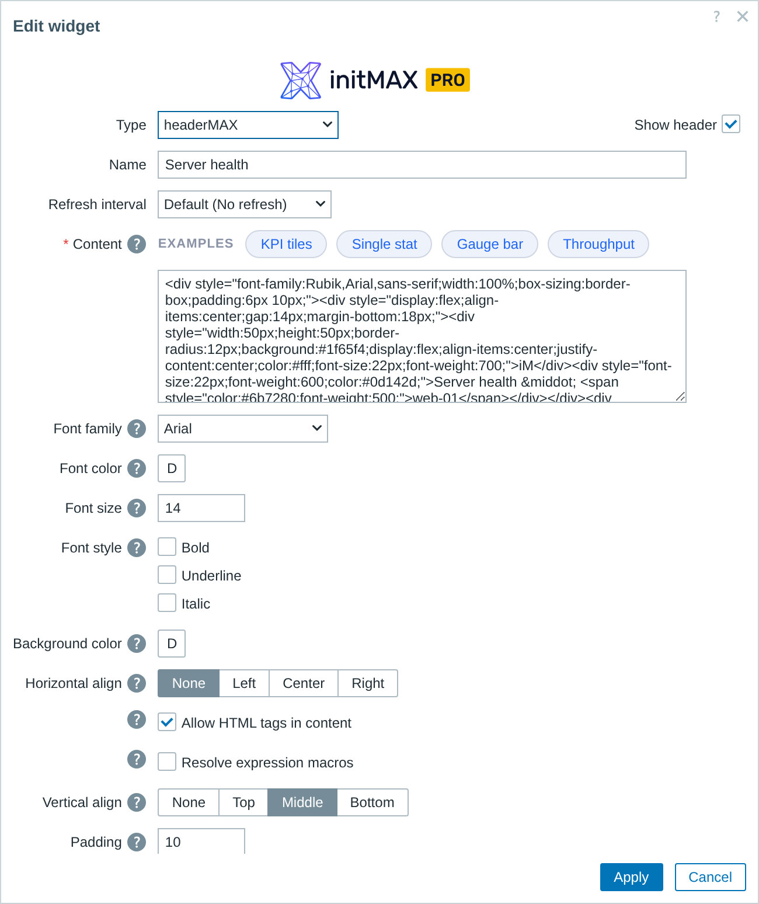
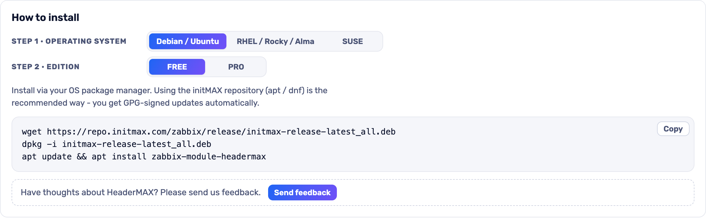

<h1>headerMAX</h1>

developed and maintained by

and community

<strong>A styled text &amp; HTML panel for Zabbix dashboards.</strong> 
Turn a wall of widgets into a clear control room — section headers, status notes and linked buttons, with full control over font, colour and alignment.

<a href="#-what-you-can-build"><strong>Features</strong></a> &nbsp;·&nbsp;
<a href="#-examples"><strong>Examples</strong></a> &nbsp;·&nbsp;
<a href="#-install"><strong>Install</strong></a> &nbsp;·&nbsp;
<a href="#-free-vs-pro"><strong>FREE vs PRO</strong></a> &nbsp;·&nbsp;
<a href="https://portal.initmax.com"><strong>Portal</strong></a> &nbsp;·&nbsp;
<a href="https://www.initmax.com/wiki/headermax/"><strong>Docs</strong></a>

 

---

## ✨ Why headerMAX

A Zabbix dashboard is a grid of widgets with no narrative. **headerMAX** gives it both structure and voice: drop a readable, styled headline, an on-call note, a status banner or a linked button exactly where it belongs — and it renders **live**, on the dashboard, instantly.

## 🎨 What you can build

<table>
<tr>
<td width="50%" valign="top">

**🎯 Section headers**
Group widgets under bold, coloured titles so operators read the board at a glance.

</td>
<td width="50%" valign="top">

**📝 Notes &amp; runbooks**
Pin on-call instructions or context right where the data is.

</td>
</tr>
<tr>
<td width="50%" valign="top">

**🔗 Linked buttons**
Jump to a runbook, ticket or another dashboard in one click.

</td>
<td width="50%" valign="top">

**🚦 Status banners**
Colour-coded state at the top of the board — green / amber / red.

</td>
</tr>
<tr>
<td width="50%" valign="top">

**⚡ One-click Examples**
Ready-made presets — KPI tiles, single stat, gauge bar, throughput.

</td>
<td width="50%" valign="top">

**🧮 Live data in text** &nbsp;PRO
Inline Zabbix expression macros — `{?last(/Host/system.cpu.load)}` — rendered live.

</td>
</tr>
</table>

## 🖼 Examples

<table>
<tr>
<td width="50%" align="center" valign="top"> <small><b>KPI header</b> — bold metrics as a banner</small></td>
<td width="50%" align="center" valign="top"> <small><b>Stat callout</b> — one number, big and clear</small></td>
</tr>
<tr>
<td width="50%" align="center" valign="top"> <small><b>Gauge label</b> — context above a gauge</small></td>
<td width="50%" align="center" valign="top"> <small><b>Throughput</b> — inbound / outbound at a glance</small></td>
</tr>
</table>

## ⚙️ Configuration

Everything lives in one familiar widget form — pick **text or HTML**, choose font, size, colours and alignment, or load a one-click preset. PRO-only fields show inline (greyed with a padlock in the FREE edition).

## 🚀 Install

Both **FREE** and **PRO** ship as **GPG-signed `deb` / `rpm` packages** from the initMAX repository — `apt` / `dnf` installs them and keeps them updated. Same flow for both editions; PRO just adds your personal repo token.

### 👉 Easiest way — the guided installer on the Portal

Open the product page, pick your **OS** and **edition**, and copy the ready-made command. FREE is fully public (no login); PRO fills in your token once you sign in. There's a feedback box right there too.

<a href="https://portal.initmax.com/catalog/zabbix-headermax#how-to-install"><strong>→ Open the installer on the Portal</strong></a>

Prefer a plain archive? Every release also ships as a **ZIP** — FREE [straight from the repo](https://repo.initmax.com/zabbix/free/zip/headermax/), PRO with your repo token — handy for offline or manual installs.

Then enable it in **Administration → General → Modules**. Done.

## 🆚 FREE vs PRO

| Feature                                                  |  FREE  |  PRO   |
| -------------------------------------------------------- | :----: | :----: |
| Multi-line styled text                                   |   ✅   |   ✅   |
| 14 font families (incl. bundled Rubik), size &amp; colour    |   ✅   |   ✅   |
| Bold / italic / underline                                |   ✅   |   ✅   |
| Background colour                                        |   ✅   |   ✅   |
| Horizontal alignment                                     |   ✅   |   ✅   |
| One-click Examples (KPI · stat · gauge · throughput)     |   ✅   |   ✅   |
| Upgrade-safe field schema (Zabbix 6.x → 7.x)             |   ✅   |   ✅   |
| **HTML content in the panel**                            |   ❌   |   ✅   |
| **Live Zabbix expression macros** `{?last(/Host/key)}`   |   ❌   |   ✅   |
| **Vertical alignment**                                   |   ❌   |   ✅   |
| **Padding control**                                      |   ❌   |   ✅   |
| **Transparent / borderless panel**                       |   ❌   |   ✅   |
| Licence                                                  | AGPLv3 | [Commercial](./LICENSE-PRO.md) |

## 📋 Requirements

|              |                                                              |
| ------------ | ------------------------------------------------------------ |
| **Zabbix**   | 6.0 · 6.2 · 6.4 · 7.0 · 7.2 · 7.4 — one package covers all    |
| **PHP**      | 7.4 or newer                                                 |
| **OS**       | Debian/Ubuntu · RHEL/Rocky/Alma/Oracle/Amazon · SUSE         |
| **Editions** | FREE (public repo) · PRO (token-gated repo)                  |

## 💬 Support &amp; links

- 📚 **[Documentation / Wiki](https://www.initmax.com/wiki/headermax/)**
- 🛒 **[Product page](https://www.initmax.com/product/headermax/)**
- 🎫 **[Portal](https://portal.initmax.com)** — downloads, tokens, support tickets
- 🧩 **Source code (FREE, AGPLv3)** — included in every package and published as a [source archive](https://repo.initmax.com/zabbix/free/zip/headermax/) on repo.initmax.com
- ✉️ **[support@initmax.com](mailto:support@initmax.com)**

---

FREE: <a href="https://www.gnu.org/licenses/agpl-3.0.html">AGPLv3</a> &nbsp;·&nbsp; PRO: <a href="./LICENSE-PRO.md">commercial</a> &nbsp;·&nbsp; © 2021–2026 initMAX s.r.o.

