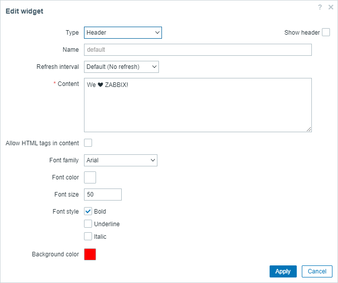

# Zabbix - Frontend module - Header widget

## Configuration popup

## Widget

## Required Zabbix version

 - Zabbix 7.0.0beta1 (master branch)
 - Zabbix 6.4.12 (6.4 branch)
 - Zabbix 6.2.9 (this branch)

## Functionality

 - Display custom text or HTML content
 - Ability to change font (style, size, color)
 - Background color

## Installation

- Clone repository into the `ui/modules/` folder (standard path is `/usr/share/zabbix/modules/`)
- Change the owner of directory to your web user with `chown`
- Go to Menu -> Administration -> General -> Modules
- Use the Scan directory button on the top
- Enable the module
- Use it and enjoy!

**Like, share and follow us** 😍 for more content:  
- [LinkedIn](https://www.linkedin.com/company/initmax/)🔥
- [Twitter](https://twitter.com/initmax)
- [Instagram](https://www.instagram.com/initmax/)
- [Facebook](https://www.facebook.com/initmax)
- [Web](https://www.initmax.cz/) 
- [Youtube](https://www.youtube.com/@initmax1) 
